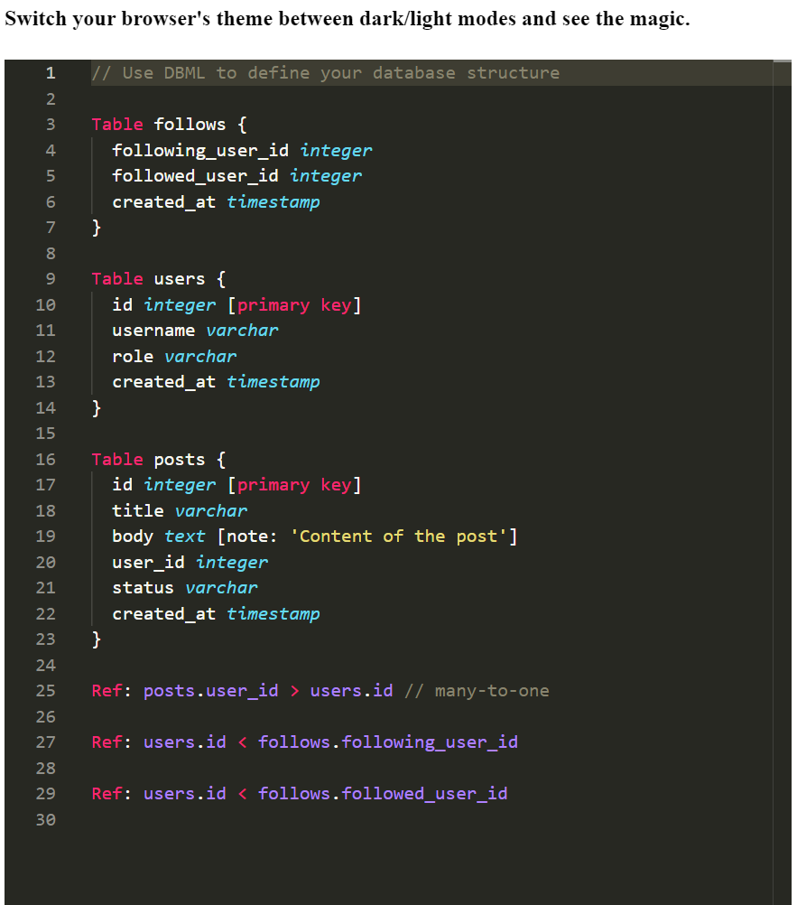

# monaco editor textmate theme and browser theme switch

This example shows how the Monaco editor's theme will change when the browser theme changes between dark/light.

## [⚡️ Play on Stackblitz](https://stackblitz.com/~/github.com/monaco-editor-trials/monaco-editor-textmate-theme-and-browser-theme-switch)

## 🌟 Preview

